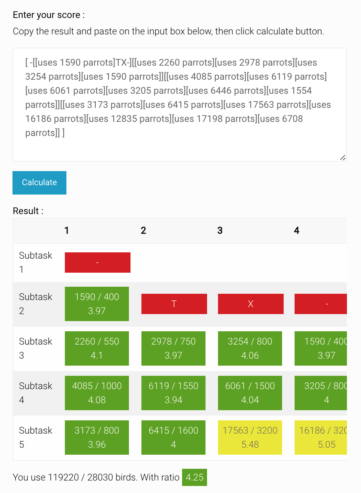

Parrots Score Calculation
===

[](https://travis-ci.org/neungkl/parrots-score-calculation)

:rocket: This work associate with 2110327 Algorithm Design class.
A project to passing the score result and parsing it to easily visually version.

:point_right: Try demo [https://neungkl.github.io/parrots-score-calculation/](https://neungkl.github.io/parrots-score-calculation/)



## Introduction

Parrots is IOI 2011 task that use for final project of algorithm study class. The detail of the task is not implicate to this project.

But if you would like to read the task. You can read more detail here *The link is not available yet*<br>
or googling with "Parrots IOI" keywords.

You must write a C or C++ for solve the task and submitted to local judge website. (created by doctoral lecturer in my university)
Then, the website will grading your code and sent the result to you.

But the result is rather hard for examine. Here are an example of result.

```
# Case 1
[-[-X-T][TTX-][--XXTT][--XXTXX]]

# Case 2
[[uses 222 parrots][-X-T][T[uses 123 parrots]X-][--XXTT][--[uses 10 parrots]XTX[uses 20 parrots]]]

# Case 3
[ [uses 40 parrots][[uses 10 parrots][uses 20 parrots][uses 30 parrots][uses 40 parrots]][[uses 100 parrots][uses 200 parrots][uses 300 parrots][uses 400 parrots]][[uses 1000 parrots][uses 2000 parrots][uses 3000 parrots][uses 4000 parrots][uses 5000 parrots][uses 6000 parrots]][[uses 1000 parrots][uses 2000 parrots][uses 3000 parrots][uses 4000 parrots][uses 5000 parrots][uses 6000 parrots][uses 7000 parrots]] ]
```

So, I end up with creating a website that analyze the score and visualize it for easily to read and good visual,
not hard for reading, and also some basic calculation stuff provided.

Features

- The size of original input data set provided
- Ratio calculation supported
- Reporting for scoring in each subtask
- Overall summarize of the scores

## Usage

### Run

Just clone this project and open `index.html`

### Testing

For testing my code. Run following command below ([Node.JS](https://nodejs.org/en/) require).

```
npm install
npm run-script test
```

## Author

* Kosate Limpongsa (Me)

## License

The MIT License (MIT)
Copyright (c) 2016 Kosate Limpongsa

Permission is hereby granted, free of charge, to any person obtaining a copy of this software and associated documentation files (the "Software"), to deal in the Software without restriction, including without limitation the rights to use, copy, modify, merge, publish, distribute, sublicense, and/or sell copies of the Software, and to permit persons to whom the Software is furnished to do so, subject to the following conditions:

The above copyright notice and this permission notice shall be included in all copies or substantial portions of the Software.

THE SOFTWARE IS PROVIDED "AS IS", WITHOUT WARRANTY OF ANY KIND, EXPRESS OR IMPLIED, INCLUDING BUT NOT LIMITED TO THE WARRANTIES OF MERCHANTABILITY, FITNESS FOR A PARTICULAR PURPOSE AND NONINFRINGEMENT. IN NO EVENT SHALL THE AUTHORS OR COPYRIGHT HOLDERS BE LIABLE FOR ANY CLAIM, DAMAGES OR OTHER LIABILITY, WHETHER IN AN ACTION OF CONTRACT, TORT OR OTHERWISE, ARISING FROM, OUT OF OR IN CONNECTION WITH THE SOFTWARE OR THE USE OR OTHER DEALINGS IN THE SOFTWARE.
